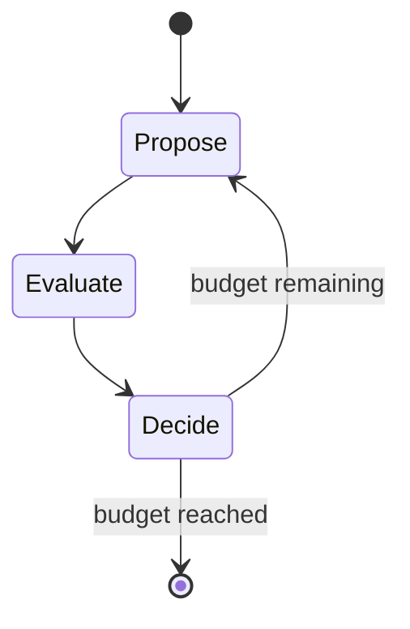

# symbolic-optimization

This repository accompanies a blog post series. It compares three search
strategies for predictive modeling on the AI4I 2020 predictive maintenance
dataset:

1. Hyperparameter optimization of scikit-learn pipelines with Optuna.
2. Symbolic regression with PySR, which searches over expression structures.
3. A large language model agent, built with pydantic-graph, that tunes
   scikit-learn hyperparameters iteratively based on recorded trial history.

All three arms optimize the same objective on the same data splits. The
repository contains the experiment code, the recorded trial logs, and the
analysis notebook. The blog text itself is written outside this repository.

## Dataset

The AI4I 2020 predictive maintenance dataset (Matzka 2020, UCI Machine
Learning Repository) contains 10,000 machine states described by five sensor
readings (air temperature, process temperature, rotational speed, torque, tool
wear), a product quality variant (L, M, or H), and failure labels. The file
`ai4i2020.csv` holds the canonical copy.

The dataset carries two targets: the binary `Machine failure` label and the
five failure mode indicators (`TWF`, `HDF`, `PWF`, `OSF`, `RNF`) from which
the failure type is derived. This project predicts `Machine failure`. All
label columns, `UDI`, and `Product ID` are excluded from the features, since
they encode the target and would cause leakage.

The labels follow a known rule set: heat dissipation failure occurs when the
temperature difference is below 8.6 K and rotational speed is below 1380 rpm;
power failure occurs when torque times rotational speed leaves the range from
3500 W to 9000 W; overstrain failure occurs when tool wear times torque
exceeds a variant-dependent threshold (11,000, 12,000, or 13,000 minNm); and
each process fails with a 0.1% probability independent of its parameters.
Symbolic regression can in principle recover these expressions, which makes
the dataset a suitable test case for comparing structure search against
parameter search.

Citation: Matzka, S. (2020). Explainable Artificial Intelligence for
Predictive Maintenance Applications. Third International Conference on
Artificial Intelligence for Industries (AI4I), 184-190.

## Experiment design

The three arms share one protocol:

- Target: binary `Machine failure`, about 3.4% positive.
- Features: five sensor columns plus the product variant, one-hot encoded.
- Validation: stratified 5-fold cross-validation, one fixed seeded split
  shared by all arms.
- Metric: average precision (area under the precision-recall curve).
- Budget: 50 cross-validation evaluations per arm. Wall-clock time is
  recorded per evaluation, so score-versus-time and score-versus-evaluation
  curves are both available.

Arms 1 and 3 search the same hyperparameter space. The estimator itself is a
searchable parameter with two branches:

- Logistic branch: `StandardScaler`, optional interaction-only polynomial
  expansion, `LogisticRegression`. The interactions allow linear models to
  express products such as torque times rotational speed.
- Random forest branch: `RandomForestClassifier` with depth, leaf size,
  feature subsampling, and class weighting parameters.

Arm 2 runs PySR on the same features and folds with a bounded expression
complexity, and logs every candidate expression it evaluates. Arm 3 sends the
trial history to a GLM 5.3 flash model through the pydantic-ai OpenAI
interface and receives the next configuration as structured output, together
with a short rationale that is logged verbatim. The loop of arm 3 is a
pydantic-graph state machine:

`Propose` calls the model with the search space description and the trial
history, `Evaluate` runs the shared cross-validation on the returned
configuration, and `Decide` loops until the evaluation budget is spent. The
model performs no tool calls; the host executes all computation.

The hypothesis spaces differ in nature. Arms 1 and 3 select between two fixed
model families and tune discrete or continuous parameters. Arm 2 searches a
space of arithmetic expressions. The spaces are not nested, and this
difference is part of the comparison, not a defect of the protocol.

## Usage

Requires Python 3.12 and uv.

    uv sync
    uv run pytest
    uv run python -m symbolic_optimization.track_optuna
    uv run python -m symbolic_optimization.track_pysr
    uv run python -m symbolic_optimization.track_agent

The agent track reads the API key from the `GLM_API_KEY` environment
variable, the model id from `GLM_MODEL` (default `glm-5.3-flash`), and the
endpoint from `GLM_BASE_URL` (default `https://api.z.ai/api/coding/paas/v4`).
PySR installs a Julia runtime on first use.

## Repository layout

    symbolic_optimization/     package with data handling and the three tracks
    notebooks/                 analysis notebook, imports the package
    results/                   JSONL trial logs, one file per arm
    tests/                     tests for data handling and the trial schema
    docs/                      implementation plan
    ai4i2020.csv               dataset

## Status

Implementation and analysis are complete. The phase plan and settled
decisions are in `docs/implementation-plan.md`, the executed analysis is in
`notebooks/analysis.ipynb`, and the recorded runs are in `results/`.

Best mean cross-validation and holdout average precision per arm:

| Arm | Best CV AP | Holdout AP |
| --- | --- | --- |
| Optuna, five seeds | 0.831 | 0.823 |
| Agent, glm-5.3-flash | 0.833 | 0.817 |
| PySR, iteration 1 | 0.546 | 0.562 |
| PySR, iteration 2 | 0.489 | 0.474 |
| Default random forest | reference | 0.769 |
| Ground-truth rules | reference | 0.844 |

Iteration 2 gives PySR the comparison and logical operators, a logistic loss,
a higher complexity bound, and a doubled budget. It scores below iteration 1:
the operator set multiplies the expression tree space while the budget only
doubles, so search throughput, not expressiveness, is the binding constraint
for symbolic regression on this task.

